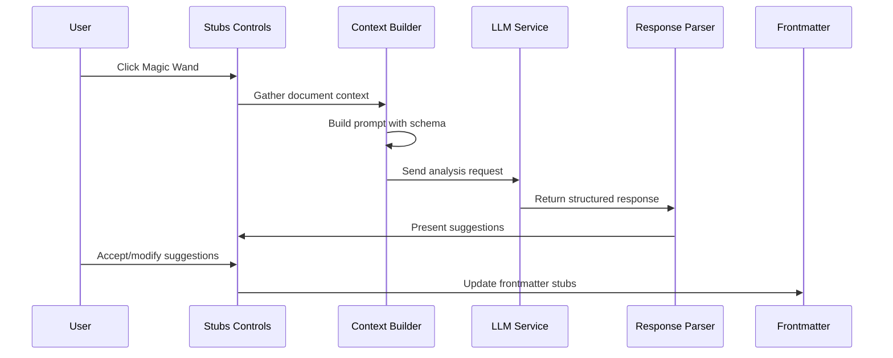

# Specification: LLM-Powered Stub Suggestions

**Version**: 0.1.0
**Date**: 2025-12-01
**Author**: Josué Guevara
**Status**: Draft

---

## 1. Overview

### 1.1 Purpose

This specification defines the **LLM-Powered Stub Suggestions** feature for M-Stubs, enabling automated analysis of document content to suggest vector-based stubs that identify knowledge gaps, missing citations, structural issues, and other editorial demands.

The feature aligns with J-Editorial Framework principles by treating stubs as **dynamic demand signals** with measurable properties—not mere TODO items. The LLM acts as an intelligent editorial assistant that understands the semantic purpose of each stub type and can identify gaps that human authors might overlook.

### 1.2 Key Capabilities

1. **Document Analysis**: Read current markdown file and analyze for gaps
2. **Semantic Stub Matching**: Map identified gaps to appropriate stub types using semantic definitions
3. **Vector Property Inference**: Suggest `stub_form`, `priority`, and `vector_family` based on gap characteristics
4. **Frontmatter Population**: Generate properly-formatted YAML stubs array
5. **Anchor Placement Suggestions**: Recommend inline anchor locations

### 1.3 User Story

> As a knowledge worker, I want to click a "magic wand" button that analyzes my document and suggests stubs for gaps I may have missed, so that I can systematically improve document quality without manually auditing every section.

---

## 2. Architecture

### 2.1 Component Overview

```
┌─────────────────────────────────────────────────────────────────────┐
│                         M-Stubs Plugin                               │
├─────────────────────────────────────────────────────────────────────┤
│                                                                      │
│  ┌──────────────┐  ┌───────────────┐  ┌────────────────────────┐   │
│  │   Stubs UI   │  │  LLM Service  │  │   Stub Type Registry   │   │
│  │              │  │               │  │                        │   │
│  │ [Magic Wand] │──│ - API Client  │──│ - Type Definitions     │   │
│  │              │  │ - Prompt Gen  │  │ - Semantic Purposes    │   │
│  │              │  │ - Response    │  │ - Vector Mappings      │   │
│  │              │  │   Parser      │  │ - Schema Loader        │   │
│  └──────────────┘  └───────────────┘  └────────────────────────┘   │
│                            │                                         │
│                            ▼                                         │
│              ┌─────────────────────────────┐                        │
│              │     Context Builder         │                        │
│              │                             │                        │
│              │ - Document content          │                        │
│              │ - Existing stubs            │                        │
│              │ - Frontmatter metadata      │                        │
│              │ - Stub type schemas         │                        │
│              │ - J-Editorial summary       │                        │
│              └─────────────────────────────┘                        │
│                                                                      │
└─────────────────────────────────────────────────────────────────────┘
```

### 2.2 Data Flow



---

## 3. Stub Type Schema Enhancement

### 3.1 Semantic Purpose Field

To enable effective LLM-based stub suggestion, each stub type must include a **semantic purpose** that describes when and why this stub type should be used.

#### 3.1.1 Extended StubTypeDefinition

```typescript
interface StubTypeDefinition {
  // Existing fields
  key: string;
  displayName: string;
  color: string;
  icon?: string;
  description?: string;
  defaults?: Record<string, unknown>;
  sortOrder?: number;

  // NEW: Semantic fields for LLM understanding
  /**
   * Detailed explanation of when to use this stub type.
   * Should describe the epistemological gap this type addresses.
   * @example "Use when a factual claim lacks supporting evidence or citation.
   *           Common indicators: statistics, quotes, historical facts,
   *           technical specifications, or any assertion that readers
   *           might reasonably question."
   */
  semanticPurpose: string;

  /**
   * The vector family this type belongs to.
   * Enables intelligent routing to appropriate resolution agents.
   */
  vectorFamily: 'Retrieval' | 'Computation' | 'Synthesis' | 'Creation' | 'Structural';

  /**
   * The ontological dimension this type addresses.
   * Provides categorical context for gap classification.
   */
  ontologicalDimension:
    | 'Epistemic Status'      // Truth/evidence concerns
    | 'Content Completeness'  // Coverage concerns
    | 'Structural Quality'    // Organization concerns
    | 'Perspective'           // Bias/neutrality concerns
    | 'Dependencies'          // External constraints
    | 'Workflow';             // Process/action concerns

  /**
   * Example indicators the LLM should look for in document content.
   * Concrete patterns that suggest this stub type is needed.
   */
  indicators?: string[];

  /**
   * Anti-patterns: situations where this type should NOT be used.
   */
  antiPatterns?: string[];
}
```

#### 3.1.2 Default Type Definitions with Semantic Purpose

```typescript
const DEFAULT_STUB_TYPES_WITH_SEMANTICS: StubTypeDefinition[] = [
  {
    key: 'link',
    displayName: 'Citation Needed',
    color: '#e67e22',
    icon: 'link',
    description: 'Content needs a citation or reference',
    defaults: { stub_form: 'persistent' },
    sortOrder: 1,

    // Semantic fields
    semanticPurpose: `Use when a factual claim, statistic, quote, or technical specification
      lacks supporting evidence or citation. This stub signals that readers cannot verify
      the information without an authoritative source. Common triggers include: numerical
      data, historical facts, API specifications, protocol references, quoted statements,
      and any claim that makes a testable assertion about the world.`,
    vectorFamily: 'Retrieval',
    ontologicalDimension: 'Epistemic Status',
    indicators: [
      'Statistics or numerical claims without source',
      'Quoted text without attribution',
      'Technical specifications without reference',
      '"According to..." without link',
      'Historical facts or dates',
      'Claims about external systems or standards'
    ],
    antiPatterns: [
      'Self-evident truths that need no citation',
      'Author\'s own opinions clearly marked as such',
      'Content already marked with placeholder citations'
    ]
  },
  {
    key: 'expand',
    displayName: 'Expand',
    color: '#2ecc71',
    icon: 'plus-circle',
    description: 'Section needs more detail or content',
    defaults: { stub_form: 'transient' },
    sortOrder: 2,

    semanticPurpose: `Use when a topic is introduced but not sufficiently developed for
      the document's intended audience. This stub signals that the current content
      provides a foundation but lacks depth, examples, or elaboration needed for
      comprehension. The gap is about insufficient coverage, not missing evidence.`,
    vectorFamily: 'Creation',
    ontologicalDimension: 'Content Completeness',
    indicators: [
      'One-sentence explanations of complex topics',
      'Bullet lists that could be paragraphs',
      '"This section covers X" without covering X',
      'Concepts introduced but not explained',
      'Procedures described without steps',
      'Empty or near-empty sections'
    ],
    antiPatterns: [
      'Intentionally brief overview sections',
      'Summaries meant to be concise',
      'Content that links to detailed docs elsewhere'
    ]
  },
  {
    key: 'question',
    displayName: 'Question',
    color: '#9b59b6',
    icon: 'help-circle',
    description: 'Open question that needs research or decision',
    defaults: { stub_form: 'transient' },
    sortOrder: 3,

    semanticPurpose: `Use when the author has an unresolved question that affects the
      content direction or accuracy. This stub surfaces uncertainty that requires
      research, stakeholder input, or decision-making before the content can be
      finalized. It represents the author's acknowledged knowledge boundary.`,
    vectorFamily: 'Computation',
    ontologicalDimension: 'Workflow',
    indicators: [
      'Explicit question marks in content',
      '"TODO: decide..." or similar markers',
      'Multiple alternatives presented without choice',
      'Uncertainty language: "might", "could", "possibly"',
      'Placeholders like TBD, TBA, XXX'
    ],
    antiPatterns: [
      'Rhetorical questions for effect',
      'Questions answered in following text',
      'FAQ-style content structure'
    ]
  },
  {
    key: 'fix',
    displayName: 'Fix',
    color: '#e74c3c',
    icon: 'alert-triangle',
    description: 'Error or issue that needs correction',
    defaults: { stub_form: 'blocking' },
    sortOrder: 4,

    semanticPurpose: `Use when there is a known error, inconsistency, or issue that
      must be corrected before the document can be considered accurate. This stub
      differs from "Question" (unknown) and "Citation Needed" (unverified)—it marks
      content that is definitively wrong or broken.`,
    vectorFamily: 'Creation',
    ontologicalDimension: 'Epistemic Status',
    indicators: [
      'Contradictions within the document',
      'Outdated information (dates, versions)',
      'Broken links or references',
      'Code examples that don\'t compile',
      'Incorrect technical specifications',
      'Logical inconsistencies'
    ],
    antiPatterns: [
      'Content that is merely incomplete',
      'Opinions that someone disagrees with',
      'Alternative approaches (not errors)'
    ]
  }
];
```

### 3.2 External Schema Support

To enable maintainability and sharing of stub type configurations, support loading from external `.json` or `.yaml` files.

#### 3.2.1 Schema File Format

**`stub-types.yaml`**:
```yaml
version: "1.0"
description: "J-Editorial aligned stub types for technical documentation"

types:
  - key: link
    displayName: Citation Needed
    color: "#e67e22"
    icon: link
    semanticPurpose: |
      Use when a factual claim lacks supporting evidence or citation.
      Common indicators: statistics, quotes, technical specifications,
      or any testable assertion about external facts.
    vectorFamily: Retrieval
    ontologicalDimension: Epistemic Status
    defaults:
      stub_form: persistent
    indicators:
      - Statistics without source
      - Quoted text without attribution
      - Technical specs without reference

  - key: expand
    displayName: Expand
    color: "#2ecc71"
    icon: plus-circle
    semanticPurpose: |
      Use when a topic is introduced but not sufficiently developed.
      The gap is about insufficient coverage, not missing evidence.
    vectorFamily: Creation
    ontologicalDimension: Content Completeness
    defaults:
      stub_form: transient
```

**`stub-types.json`**:
```json
{
  "version": "1.0",
  "description": "J-Editorial aligned stub types",
  "types": [
    {
      "key": "link",
      "displayName": "Citation Needed",
      "color": "#e67e22",
      "semanticPurpose": "Use when a factual claim lacks supporting evidence...",
      "vectorFamily": "Retrieval",
      "ontologicalDimension": "Epistemic Status"
    }
  ]
}
```

#### 3.2.2 Schema Directory Configuration

```typescript
interface SchemaDirectoryConfig {
  /**
   * Directory containing schema files.
   * Can be absolute path or relative to vault root.
   *
   * @default ".obsidian/plugins/m-stubs/schemas"
   * @example "/Users/shared/editorial-standards/schemas"
   * @example "Templates/Schemas"
   */
  schemaDirectory: string;

  /**
   * Primary schema filename (without extension).
   * Plugin will look for .yaml, .yml, or .json in that order.
   *
   * @default "stub-types"
   */
  schemaFilename: string;

  /**
   * Whether to merge external schema with built-in types.
   * If false, external schema completely replaces built-ins.
   * @default true
   */
  mergeWithBuiltIn: boolean;

  /**
   * Auto-reload schema when file changes.
   * @default true
   */
  watchForChanges: boolean;
}
```

#### 3.2.3 Schema Loading Priority

**Loading Order**:
1. Load built-in default types (always available as fallback)
2. Check `schemaDirectory` for `{schemaFilename}.yaml`, `.yml`, or `.json`
3. If schema file exists:
   - Parse and validate schema structure
   - If `mergeWithBuiltIn`: merge (external overrides duplicates by key)
   - If not: replace entirely
4. Apply any user settings overrides (from plugin settings UI)

**Settings UI**:
```
▼ Schema Configuration

  Schema Directory
  ┌─────────────────────────────────────────────────────┐
  │ .obsidian/plugins/m-stubs/schemas                   │  [Browse]
  └─────────────────────────────────────────────────────┘
  Default: Plugin folder. Can be any folder in vault or absolute path.

  Schema Filename
  ┌─────────────────────────────────────────────────────┐
  │ stub-types                                          │
  └─────────────────────────────────────────────────────┘
  Will look for .yaml, .yml, or .json extension.

  [x] Merge with built-in types (external overrides duplicates)
  [x] Watch for changes and auto-reload

  Schema Status: ✓ Loaded from stub-types.yaml (4 types)
  [Reload Schema]  [View Loaded Schema]
```

---

## 4. LLM Integration

### 4.1 Supported Providers (Phase 1)

```typescript
// Phase 1: OpenAI and Anthropic
// Phase 2: Add Ollama and custom endpoints
type LLMProvider = 'openai' | 'anthropic';

interface LLMConfiguration {
  /**
   * Selected LLM provider
   */
  provider: LLMProvider;

  /**
   * API key (stored in plugin settings, NOT in vault files)
   * Note: Obsidian settings are not encrypted on disk
   */
  apiKey: string;

  /**
   * Model identifier
   * @example "gpt-4o", "claude-3-5-sonnet-20241022", "llama3.2"
   */
  model: string;

  /**
   * API endpoint (for custom/self-hosted providers)
   * @example "http://localhost:11434/api" for Ollama
   */
  endpoint?: string;

  /**
   * Maximum tokens to use for analysis
   * @default 4096
   */
  maxTokens: number;

  /**
   * Temperature for response generation
   * Lower = more deterministic, higher = more creative
   * @default 0.3 (we want consistent, predictable suggestions)
   */
  temperature: number;
}
```

### 4.2 Provider-Specific Implementations

#### 4.2.1 OpenAI

```typescript
interface OpenAIConfig extends LLMConfiguration {
  provider: 'openai';
  model: 'gpt-4o' | 'gpt-4o-mini' | 'gpt-4-turbo' | string;
  organizationId?: string;
}

// API call structure
const response = await fetch('https://api.openai.com/v1/chat/completions', {
  method: 'POST',
  headers: {
    'Authorization': `Bearer ${config.apiKey}`,
    'Content-Type': 'application/json',
  },
  body: JSON.stringify({
    model: config.model,
    messages: [
      { role: 'system', content: systemPrompt },
      { role: 'user', content: userPrompt }
    ],
    max_tokens: config.maxTokens,
    temperature: config.temperature,
    response_format: { type: 'json_object' }
  })
});
```

#### 4.2.2 Anthropic

```typescript
interface AnthropicConfig extends LLMConfiguration {
  provider: 'anthropic';
  model: 'claude-3-5-sonnet-20241022' | 'claude-3-5-haiku-20241022' | string;
}

// API call structure
const response = await fetch('https://api.anthropic.com/v1/messages', {
  method: 'POST',
  headers: {
    'x-api-key': config.apiKey,
    'anthropic-version': '2023-06-01',
    'content-type': 'application/json',
  },
  body: JSON.stringify({
    model: config.model,
    max_tokens: config.maxTokens,
    system: systemPrompt,
    messages: [{ role: 'user', content: userPrompt }]
  })
});
```

#### 4.2.3 Future: Ollama (Local) - Phase 2

> **Note**: Ollama support planned for Phase 2 to provide privacy-focused local model option.

```typescript
// Phase 2 implementation
interface OllamaConfig extends LLMConfiguration {
  provider: 'ollama';
  endpoint: string; // e.g., 'http://localhost:11434'
  model: string;    // e.g., 'llama3.2', 'mistral', 'codellama'
}
```

### 4.3 Settings UI

```
▼ LLM Configuration

  Provider
  (•) Anthropic (Claude)
  ( ) OpenAI

  ─────────────────────────────────────────────────────

  API Key
  ┌─────────────────────────────────────────────────────┐
  │ ••••••••••••••••••••••••                            │  [Show] [Test]
  └─────────────────────────────────────────────────────┘
  ⚠️ API keys are stored in plugin settings (not encrypted).
     Consider using environment variables for production.

  Model
  ┌─────────────────────────────────────────────────────┐
  │ claude-3-5-sonnet-20241022                     [▼]  │
  └─────────────────────────────────────────────────────┘
  Anthropic: claude-3-5-sonnet, claude-3-5-haiku
  OpenAI: gpt-4o, gpt-4o-mini, gpt-4-turbo

  ─────────────────────────────────────────────────────

  ▼ Advanced Settings

    Max Tokens [=====•====] 4096

    Temperature [•=========] 0.3
    Lower = more consistent, Higher = more creative

    Request Timeout [====•=====] 30s

  ─────────────────────────────────────────────────────

  ▼ Debugging & Dry Run

    [x] Enable debug mode
        Shows detailed logs in developer console

    [ ] Dry run mode
        Preview prompts without sending to API

    [View Last Request]  [View Last Response]
    [Export Debug Log]

  ─────────────────────────────────────────────────────

  ▼ Cost Estimation (Last 30 days)

    Requests: 47
    Tokens used: ~125,000
    Estimated cost: ~$0.63

  [Clear Usage History]
```

---

## 5. Prompt Engineering

### 5.1 Strong Default System Prompt

The system prompt provides comprehensive context about Doc Doctor and J-Editorial principles. This strong default works even when stub types don't have custom `semanticPurpose` definitions—the prompt itself explains the philosophy and common gap patterns.

**Design Principle**: Schema definitions override defaults. If a stub type has `semanticPurpose`, `indicators`, and `antiPatterns` defined, those are used. Otherwise, the system prompt provides general guidance that the LLM applies to all stub types.

```typescript
const DEFAULT_SYSTEM_PROMPT = `You are an editorial assistant for M-Stubs, an Obsidian plugin
implementing the J-Editorial Framework for knowledge management. Your role is to analyze
documents and identify knowledge gaps that should be marked with "stubs."

## What is M-Stubs?

M-Stubs is a vector-based stubs system that transforms document gaps into trackable,
actionable demand signals. Unlike simple TODO lists, stubs have:

1. **Type**: Categorizes the nature of the gap (citation needed, expand, question, fix, etc.)
2. **Form**: Indicates severity and lifecycle (transient, persistent, blocking, structural)
3. **Priority**: Urgency level (low, medium, high, critical)
4. **Vector Properties**: Enable intelligent routing and resolution forecasting

## The J-Editorial Philosophy

Stubs follow a three-layer architecture:
- **L1 (Intrinsic)**: What the stub IS - stored in frontmatter, portable metadata
- **L2 (Extrinsic)**: What the stub MEANS - calculated dimensions (health, urgency, controversy)
- **L3 (Operational)**: How the stub BEHAVES - automation rules and workflows

Stubs affect document refinement scores:
- \`transient\`: -0.02 per stub (minor, resolve soon)
- \`persistent\`: -0.05 per stub (long-term tracking)
- \`blocking\`: -0.10 per stub (must resolve before promotion)
- \`structural\`: -0.15 per stub (fundamental architecture issue)

## The Five Vector Families

Every gap belongs to one of five editorial work families:

| Family | Description | Examples |
|--------|-------------|----------|
| **Retrieval** | Finding existing information | Citations, references, fact-checking |
| **Computation** | Analyzing and deriving values | Clarifications, calculations, research |
| **Synthesis** | Combining multiple perspectives | Resolving conflicts, balancing views |
| **Creation** | Generating new content | Expanding sections, adding examples |
| **Structural** | Architectural changes | Reorganizing, splitting, dependencies |

## Common Gap Patterns to Identify

When analyzing documents, look for:

**Epistemic Gaps** (truth/evidence concerns):
- Statistics or claims without sources
- "According to..." without attribution
- Technical specifications without references
- Dubious or questionable assertions

**Completeness Gaps** (coverage concerns):
- Sections that are too brief for their importance
- Concepts introduced but not explained
- Procedures without steps
- Empty or placeholder sections
- Missing examples for abstract concepts

**Structural Gaps** (organization concerns):
- Poor flow between sections
- Content that should be split or merged
- Inconsistent depth across sections

**Workflow Gaps** (action concerns):
- Unresolved questions (TBD, TBA, ???)
- TODOs embedded in content
- Placeholders like XXX or FIXME

## Your Task

Analyze the provided document and identify gaps. For each gap:
1. Determine the most appropriate stub type from the available types
2. Write a clear, actionable description (not generic like "needs work")
3. Suggest stub_form based on severity
4. Identify the location (section or context quote)
5. Provide rationale for your choice

## Guidelines

- **Be specific**: "Add citation for OAuth 2.0 token expiration claim" not "needs citation"
- **Be conservative**: Only flag genuine gaps, not stylistic preferences
- **Don't duplicate**: Check existing stubs before suggesting new ones
- **Consider audience**: Personal notes have lower standards than public docs
- **Consider form**: A "developing" document expects more gaps than "stable"
- **Quality over quantity**: A few precise suggestions beats many vague ones

## Output Format

Respond with valid JSON matching the specified schema.`;
```

### 5.2 Context Builder

```typescript
interface DocumentContext {
  // Document content
  content: string;

  // Frontmatter metadata
  frontmatter: {
    title?: string;
    description?: string;
    refinement?: number;
    form?: 'transient' | 'developing' | 'stable' | 'evergreen' | 'canonical';
    audience?: 'personal' | 'internal' | 'trusted' | 'public';
    stubs?: ParsedStub[];
  };

  // Available stub types with semantic definitions
  stubTypes: StubTypeDefinition[];

  // Structured properties available
  structuredProperties: StructuredPropertyDefinition[];
}

function buildUserPrompt(context: DocumentContext): string {
  return `## Document to Analyze

### Frontmatter
\`\`\`yaml
title: ${context.frontmatter.title || 'Untitled'}
description: ${context.frontmatter.description || 'No description'}
refinement: ${context.frontmatter.refinement || 'Not specified'}
form: ${context.frontmatter.form || 'Not specified'}
audience: ${context.frontmatter.audience || 'Not specified'}
\`\`\`

### Existing Stubs
${context.frontmatter.stubs?.length
  ? context.frontmatter.stubs.map(s => `- ${s.type}: "${s.description}"`).join('\n')
  : 'None'}

### Content
\`\`\`markdown
${context.content}
\`\`\`

---

## Available Stub Types

${context.stubTypes.map(type => `
### ${type.displayName} (\`${type.key}\`)
**Vector Family**: ${type.vectorFamily}
**Dimension**: ${type.ontologicalDimension}
**Purpose**: ${type.semanticPurpose}
${type.indicators ? `**Look for**: ${type.indicators.join(', ')}` : ''}
${type.antiPatterns ? `**Avoid when**: ${type.antiPatterns.join(', ')}` : ''}
`).join('\n')}

---

## Your Response

Analyze the document and suggest stubs. Respond with JSON:

\`\`\`json
{
  "analysis_summary": "Brief overview of document quality and gaps found",
  "suggested_stubs": [
    {
      "type": "stub_type_key",
      "description": "Clear, actionable description of the gap",
      "stub_form": "transient|persistent|blocking",
      "priority": "low|medium|high|critical",
      "location": {
        "section": "Section heading where gap appears",
        "context": "Brief quote or description of where in section"
      },
      "rationale": "Why this stub type was chosen"
    }
  ],
  "confidence": 0.0-1.0
}
\`\`\``;
}
```

### 5.3 Response Schema

```typescript
interface LLMSuggestionResponse {
  /**
   * Brief overview of document quality assessment
   */
  analysis_summary: string;

  /**
   * Suggested stubs to add
   */
  suggested_stubs: SuggestedStub[];

  /**
   * Overall confidence in suggestions (0-1)
   */
  confidence: number;
}

interface SuggestedStub {
  /**
   * Stub type key (must match configured types)
   */
  type: string;

  /**
   * Clear, actionable description
   */
  description: string;

  /**
   * Suggested severity/lifecycle
   */
  stub_form: 'transient' | 'persistent' | 'blocking';

  /**
   * Suggested priority
   */
  priority?: 'low' | 'medium' | 'high' | 'critical';

  /**
   * Location in document
   */
  location: {
    section?: string;
    context?: string;
    lineHint?: number;
  };

  /**
   * Explanation for why this stub was suggested
   */
  rationale: string;
}
```

### 5.4 Response Validation

```typescript
function validateLLMResponse(response: unknown): LLMSuggestionResponse {
  // Type checking
  if (!response || typeof response !== 'object') {
    throw new Error('Invalid response format');
  }

  const r = response as Record<string, unknown>;

  // Validate required fields
  if (!Array.isArray(r.suggested_stubs)) {
    throw new Error('Missing suggested_stubs array');
  }

  // Validate each stub
  const validStubs: SuggestedStub[] = [];

  for (const stub of r.suggested_stubs) {
    if (!isValidStubSuggestion(stub)) {
      console.warn('Skipping invalid stub suggestion:', stub);
      continue;
    }

    // Validate stub type exists in configuration
    if (!configuredTypes.has(stub.type)) {
      console.warn(`Unknown stub type "${stub.type}", skipping`);
      continue;
    }

    validStubs.push(stub);
  }

  return {
    analysis_summary: String(r.analysis_summary || ''),
    suggested_stubs: validStubs,
    confidence: Number(r.confidence) || 0.5
  };
}
```

---

## 6. User Interface

### 6.1 Magic Wand Button

Add to stubs controls bar (`stubs-controls-bar.svelte`):

```svelte
<button
    class="control-btn"
    class:active={isAnalyzing}
    class:disabled={!hasLLMConfig}
    on:click={handleMagicWand}
    title={hasLLMConfig
      ? "Analyze document for stub suggestions"
      : "Configure LLM in settings to enable"}
>
    {#if isAnalyzing}
        <Loader2 size={14} class="animate-spin" />
    {:else}
        <Wand2 size={14} />
    {/if}
</button>
```

### 6.2 Suggestions Panel

When analysis completes, show a review panel:

```
┌────────────────────────────────────────────────────────────────────┐
│ Stub Suggestions                                         [×] Close │
├────────────────────────────────────────────────────────────────────┤
│                                                                     │
│ Analysis: Found 4 potential gaps in your document.                 │
│ Confidence: 85%                                                     │
│                                                                     │
│ ─────────────────────────────────────────────────────────────────  │
│                                                                     │
│ ☐ [●] Citation Needed                              [Accept] [Skip]  │
│   "Add reference for OAuth 2.0 token expiration claim"              │
│   Section: Authentication > Token Lifecycle                         │
│   Form: persistent | Priority: medium                               │
│   ▸ Rationale: The claim "tokens expire after 24 hours" is a        │
│     verifiable technical specification that requires citation.      │
│                                                                     │
│ ─────────────────────────────────────────────────────────────────  │
│                                                                     │
│ ☐ [●] Expand                                       [Accept] [Skip]  │
│   "Add code examples for Python and JavaScript clients"             │
│   Section: API Reference > Authentication                           │
│   Form: transient | Priority: low                                   │
│   ▸ Rationale: The API documentation mentions client libraries      │
│     but provides no usage examples.                                 │
│                                                                     │
│ ─────────────────────────────────────────────────────────────────  │
│                                                                     │
│ ☐ [●] Question                                     [Accept] [Skip]  │
│   "Clarify rate limiting behavior for burst requests"               │
│   Section: Rate Limiting                                            │
│   Form: transient | Priority: medium                                │
│   ▸ Rationale: Text says "requests are limited" but doesn't         │
│     specify the limit or behavior when exceeded.                    │
│                                                                     │
│ ─────────────────────────────────────────────────────────────────  │
│                                                                     │
│         [Accept All (4)]  [Accept Selected (0)]  [Cancel]           │
│                                                                     │
└────────────────────────────────────────────────────────────────────┘
```

### 6.3 Inline Anchor Placement

When accepting a suggestion, offer anchor placement options:

```
┌────────────────────────────────────────────────────────────┐
│ Place Anchor for: "Add reference for OAuth 2.0..."    [×]  │
├────────────────────────────────────────────────────────────┤
│                                                            │
│ (•) Auto-place at suggested location                       │
│     Line 47: "tokens expire after 24 hours ^stub-abc123"   │
│                                                            │
│ ( ) Place at current cursor position                       │
│                                                            │
│ ( ) Add to frontmatter only (no inline anchor)             │
│                                                            │
│                        [Place Anchor]  [Cancel]            │
└────────────────────────────────────────────────────────────┘
```

---

## 7. Error Handling

### 7.1 Error Types

```typescript
type LLMErrorType =
  | 'no_api_key'
  | 'invalid_api_key'
  | 'rate_limited'
  | 'context_too_long'
  | 'network_error'
  | 'invalid_response'
  | 'provider_error'
  | 'timeout';

interface LLMError {
  type: LLMErrorType;
  message: string;
  retryable: boolean;
  suggestedAction?: string;
}

const ERROR_MESSAGES: Record<LLMErrorType, LLMError> = {
  no_api_key: {
    type: 'no_api_key',
    message: 'No API key configured',
    retryable: false,
    suggestedAction: 'Open Settings → M-Stubs → LLM Configuration'
  },
  invalid_api_key: {
    type: 'invalid_api_key',
    message: 'API key is invalid or expired',
    retryable: false,
    suggestedAction: 'Check your API key in settings'
  },
  rate_limited: {
    type: 'rate_limited',
    message: 'Rate limit exceeded',
    retryable: true,
    suggestedAction: 'Wait a moment and try again'
  },
  context_too_long: {
    type: 'context_too_long',
    message: 'Document too long for analysis',
    retryable: false,
    suggestedAction: 'Try analyzing a smaller section'
  },
  // ... etc
};
```

### 7.2 User Feedback

```svelte
{#if error}
  <div class="llm-error">
    <AlertCircle size={16} />
    <span>{error.message}</span>
    {#if error.suggestedAction}
      <button on:click={handleSuggestedAction}>
        {error.suggestedAction}
      </button>
    {/if}
    {#if error.retryable}
      <button on:click={retry}>Retry</button>
    {/if}
  </div>
{/if}
```

---

## 8. Cost & Token Management

### 8.1 Token Estimation

```typescript
function estimateTokens(text: string): number {
  // Rough estimation: ~4 characters per token for English
  return Math.ceil(text.length / 4);
}

function estimateCost(
  inputTokens: number,
  outputTokens: number,
  model: string
): number {
  const pricing: Record<string, { input: number; output: number }> = {
    'gpt-4o': { input: 0.0025, output: 0.01 },         // per 1K tokens
    'gpt-4o-mini': { input: 0.00015, output: 0.0006 },
    'claude-3-5-sonnet': { input: 0.003, output: 0.015 },
    'claude-3-5-haiku': { input: 0.0008, output: 0.004 },
  };

  const p = pricing[model] || { input: 0.001, output: 0.002 };
  return (inputTokens * p.input + outputTokens * p.output) / 1000;
}
```

### 8.2 Pre-flight Estimation

Before sending request, show user estimated cost:

```
┌──────────────────────────────────────────────────┐
│ Analyze Document                                  │
├──────────────────────────────────────────────────┤
│                                                   │
│ Document: API-Documentation.md                    │
│ Size: ~2,400 words (~3,000 tokens)               │
│                                                   │
│ Estimated cost: ~$0.02                           │
│ (gpt-4o, including response)                     │
│                                                   │
│            [Cancel]  [Analyze]                   │
└──────────────────────────────────────────────────┘
```

### 8.3 Long Document Handling

For documents exceeding token limits:

```typescript
interface ChunkingStrategy {
  /**
   * Maximum tokens per chunk
   */
  maxChunkTokens: number;

  /**
   * How to split document
   */
  splitBy: 'section' | 'paragraph' | 'fixed';

  /**
   * Overlap between chunks (for context continuity)
   */
  overlapTokens: number;
}

async function analyzeInChunks(
  content: string,
  strategy: ChunkingStrategy
): Promise<LLMSuggestionResponse> {
  const chunks = splitContent(content, strategy);
  const results: SuggestedStub[] = [];

  for (const chunk of chunks) {
    const response = await analyzeSingleChunk(chunk);
    results.push(...response.suggested_stubs);
  }

  // Deduplicate similar suggestions
  return deduplicateStubs(results);
}
```

---

## 9. Debugging & Dry Run Mode

### 9.1 Debug Configuration

```typescript
interface DebugConfig {
  /**
   * Enable verbose logging to developer console
   * @default false
   */
  enabled: boolean;

  /**
   * Dry run mode - preview prompts without API calls
   * @default false
   */
  dryRunMode: boolean;

  /**
   * Store last N request/response pairs for inspection
   * @default 5
   */
  historySize: number;

  /**
   * Log level for console output
   */
  logLevel: 'error' | 'warn' | 'info' | 'debug' | 'trace';
}
```

### 9.2 Dry Run Mode

When enabled, dry run mode allows users to preview what would be sent to the LLM without making an actual API call. This is useful for:
- Debugging prompt construction
- Verifying schema loading
- Testing without API costs
- Understanding what context the LLM receives

**Dry Run Panel**:
```
┌────────────────────────────────────────────────────────────────────┐
│ Dry Run Preview                                         [×] Close  │
├────────────────────────────────────────────────────────────────────┤
│                                                                     │
│ Provider: Anthropic (claude-3-5-sonnet-20241022)                   │
│ Estimated tokens: ~3,500 input                                      │
│                                                                     │
│ ▼ System Prompt (2,100 tokens)                                      │
│ ┌─────────────────────────────────────────────────────────────────┐│
│ │ You are an editorial assistant for M-Stubs, an Obsidian plugin  ││
│ │ implementing the J-Editorial Framework for knowledge management.││
│ │ ...                                                              ││
│ └─────────────────────────────────────────────────────────────────┘│
│                                                                     │
│ ▼ User Prompt (1,400 tokens)                                        │
│ ┌─────────────────────────────────────────────────────────────────┐│
│ │ ## Document to Analyze                                          ││
│ │                                                                  ││
│ │ ### Frontmatter                                                  ││
│ │ ```yaml                                                          ││
│ │ title: API Documentation                                         ││
│ │ ...                                                              ││
│ └─────────────────────────────────────────────────────────────────┘│
│                                                                     │
│ ▼ Stub Types Included (4 types)                                     │
│   • link (Citation Needed) - Retrieval                              │
│   • expand (Expand) - Creation                                      │
│   • question (Question) - Computation                               │
│   • fix (Fix) - Creation                                            │
│                                                                     │
│          [Copy to Clipboard]  [Send Request]  [Close]               │
└────────────────────────────────────────────────────────────────────┘
```

### 9.3 Debug Logging

When debug mode is enabled, log the following to developer console:

```typescript
// Example debug output
console.group('[M-Stubs LLM] Analysis Request');
console.log('Provider:', config.provider);
console.log('Model:', config.model);
console.log('Document:', file.path);
console.log('Token estimate:', estimatedTokens);
console.groupCollapsed('System Prompt');
console.log(systemPrompt);
console.groupEnd();
console.groupCollapsed('User Prompt');
console.log(userPrompt);
console.groupEnd();
console.groupCollapsed('Stub Types');
console.table(stubTypes.map(t => ({ key: t.key, family: t.vectorFamily })));
console.groupEnd();
console.groupEnd();

// After response
console.group('[M-Stubs LLM] Analysis Response');
console.log('Status:', response.status);
console.log('Duration:', `${duration}ms`);
console.log('Tokens used:', response.usage);
console.log('Suggestions:', response.suggested_stubs.length);
console.groupCollapsed('Raw Response');
console.log(JSON.stringify(response, null, 2));
console.groupEnd();
console.groupEnd();
```

### 9.4 Request/Response History

Store recent requests for debugging:

```typescript
interface RequestHistoryEntry {
  id: string;
  timestamp: Date;
  documentPath: string;
  provider: LLMProvider;
  model: string;

  request: {
    systemPrompt: string;
    userPrompt: string;
    tokenEstimate: number;
  };

  response?: {
    raw: string;
    parsed: LLMSuggestionResponse;
    tokensUsed: { input: number; output: number };
    duration: number;
  };

  error?: LLMError;
}

// Accessible via command palette or settings
// Command: "M-Stubs: View LLM Request History"
```

### 9.5 Debug Panel UI

Add a debug panel accessible from settings or command palette:

```
┌────────────────────────────────────────────────────────────────────┐
│ LLM Debug Panel                                         [×] Close  │
├────────────────────────────────────────────────────────────────────┤
│                                                                     │
│ ▼ Configuration Status                                              │
│   Provider: Anthropic ✓                                             │
│   API Key: Configured ✓                                             │
│   Model: claude-3-5-sonnet-20241022 ✓                              │
│   Schema: Loaded from stub-types.yaml (4 types) ✓                  │
│                                                                     │
│ ▼ Recent Requests (3)                                               │
│ ┌───────────────────────────────────────────────────────────────┐  │
│ │ 12:34:05 | API-Docs.md | 4 suggestions | 1.2s | $0.02        │  │
│ │ 12:30:12 | README.md   | 2 suggestions | 0.9s | $0.01        │  │
│ │ 12:25:48 | Design.md   | ERROR: rate_limited                 │  │
│ └───────────────────────────────────────────────────────────────┘  │
│                                                                     │
│ ▼ Selected Request Details                                          │
│   [View Request]  [View Response]  [Copy as cURL]                  │
│                                                                     │
│ ─────────────────────────────────────────────────────────────────  │
│                                                                     │
│ [Test API Connection]  [Clear History]  [Export Log]               │
└────────────────────────────────────────────────────────────────────┘
```

---

## 10. Implementation Phases

### Phase 1: Core Infrastructure (MVP)
- [ ] Add `semanticPurpose` field to `StubTypeDefinition`
- [ ] Implement LLM service with Anthropic and OpenAI support
- [ ] Create settings UI for API key configuration
- [ ] Build strong default system prompt
- [ ] Build context builder with document + type schemas
- [ ] Add magic wand button to controls bar
- [ ] Create suggestions review panel
- [ ] Implement dry run mode
- [ ] Add basic debug logging

### Phase 2: Enhanced Experience
- [ ] Implement external schema loading (.yaml/.json)
- [ ] Add configurable schema directory
- [ ] Add cost estimation and tracking
- [ ] Implement anchor placement suggestions
- [ ] Add suggestion editing before acceptance
- [ ] Implement chunking for long documents
- [ ] Add debug panel UI
- [ ] Add request/response history

### Phase 3: Polish & Optimization
- [ ] Add response caching (same document, same types)
- [ ] Implement suggestion quality feedback loop
- [ ] Add batch analysis for multiple documents
- [ ] Optimize prompts based on usage patterns
- [ ] Add export/import of custom type schemas
- [ ] Add Ollama support for local models

---

## 11. Security Considerations

### 11.1 API Key Storage

- API keys stored in Obsidian's plugin settings (`data.json`)
- Settings file is NOT encrypted on disk
- Users should be warned about this limitation
- Consider supporting environment variables as alternative

### 11.2 Content Privacy

- Document content is sent to external LLM APIs
- Users must consent to this before first use
- Provide option to use local models (Ollama) for privacy
- Never log or cache document content

### 11.3 First-Use Consent

```
┌────────────────────────────────────────────────────────────────────┐
│ Enable LLM-Powered Stub Suggestions                                │
├────────────────────────────────────────────────────────────────────┤
│                                                                     │
│ This feature sends your document content to an external AI          │
│ service for analysis. Please review before enabling:                │
│                                                                     │
│ • Your document text will be sent to: OpenAI (gpt-4o)              │
│ • Content is processed to identify knowledge gaps                   │
│ • No content is stored by M-Stubs after analysis                   │
│ • See provider's privacy policy for their data handling            │
│                                                                     │
│ ☐ I understand and consent to sending document content to the      │
│   configured LLM provider for analysis.                            │
│                                                                     │
│ For maximum privacy, consider using Ollama (local models).         │
│                                                                     │
│                              [Cancel]  [Enable]                     │
└────────────────────────────────────────────────────────────────────┘
```

---

## 12. Success Criteria

### 12.1 Functional Requirements

- [ ] User can configure LLM provider and API key in settings
- [ ] User can click magic wand to analyze current document
- [ ] LLM receives document content with stub type semantic definitions
- [ ] Suggestions are presented in reviewable panel
- [ ] User can accept, modify, or skip individual suggestions
- [ ] Accepted stubs are added to frontmatter with proper format
- [ ] Inline anchors can be auto-placed at suggested locations
- [ ] Error states are handled gracefully with actionable messages

### 12.2 Quality Requirements

- [ ] Suggestions match semantic purpose of stub types
- [ ] False positive rate < 20% (most suggestions are genuinely useful)
- [ ] Response time < 10s for typical documents
- [ ] Graceful degradation for long documents
- [ ] No duplicate suggestions for existing stubs

### 12.3 Security Requirements

- [ ] User consent obtained before first LLM request
- [ ] API keys not exposed in logs or UI
- [ ] Document content not cached or logged
- [ ] Local model option available (Ollama)

---

## 13. See Also

- [PRD-stubs-support.md](./PRD-stubs-support.md) - Main stubs feature PRD
- [SPEC-configuration-schema.md](./SPEC-configuration-schema.md) - Configuration schema
- [J-Editorial Stubs Standard](../../../Llull/Standards/J-Editorial/framework/02-practice/stubs/spec-stubs-standard.md)
- [Inline Types Taxonomy](../../../Llull/Standards/J-Editorial/framework/02-practice/stubs/ref-inline-types.md)

---

**Document History**:
- 2025-12-01: Initial draft
